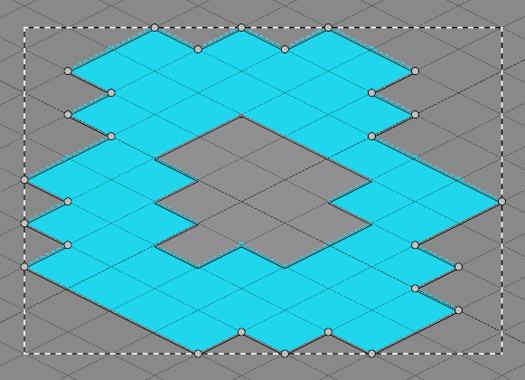

# ISGenerator

ISGenerator is a [Tiled](https://www.mapeditor.org) extension for creating polygons that fit tightly around tile-covered areas on a selected layer.

## Install

Download the archive from the release page and extract it to the extension folder as suggested in

[Official scripting docs](https://doc.mapeditor.org/en/stable/reference/scripting/#scripted-extensions)

## Usage

Select the layer in the Layers view, then right-click to open the context menu and select "Create Island Shores".

## Notice

Staggered and hexagonal maps are not currently supported.
